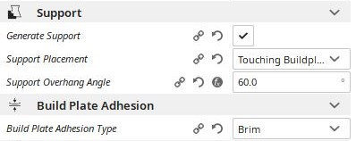
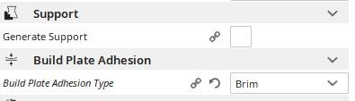
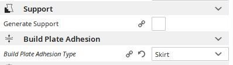

# 3D print settings

- **feeder_pipe_printOrientation.stl**
    - 
- **slide_printOrientation.stl**
    - 
- **feeder_pipe_extention_printOrientation.stl**, **feeder_servo_horn_printOrientation.stl** en **offsest_bus_printOrientation.stl**
    - 